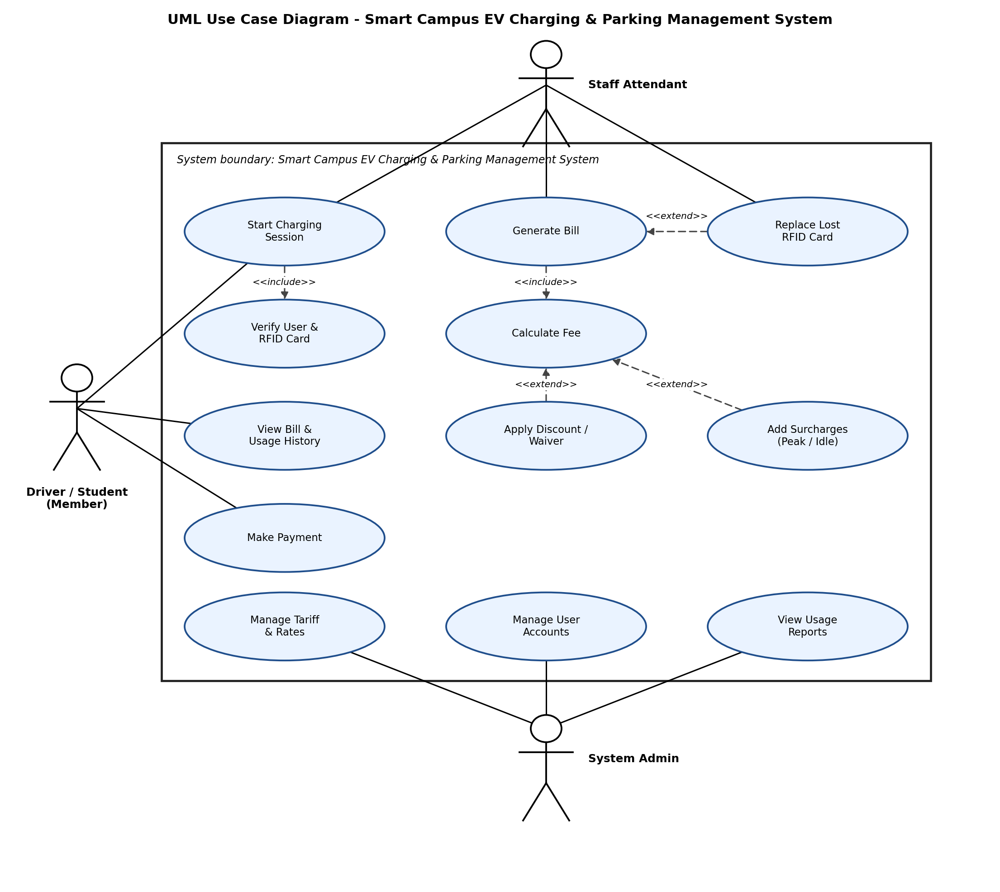

# Task 3: UML Use Case & Class Diagram

## 1. UML Use Case Diagram

**Actors:**
- Driver / Student (Member)
- Staff Attendant
- System Admin

**Key Use Cases:**
- Start Charging Session
- Generate Bill
- Calculate Fee
- Apply Discount / Waiver
- Add Surcharges (Peak Hour / Idle)
- Replace Lost RFID Card

---

## 2. UML Class Diagram

Four Classes:
- `User` (parent)
- `MemberUser` (child, IS-A User)
- `EVCharger`
- `ChargingSession` (HAS-A User and HAS-A EVCharger)

OOP Concepts Demonstrated:
- Inheritance (IS-A): `MemberUser(User)` calls `super().__init__()`
- Encapsulation: private attributes with getters/setters
- Polymorphism: `calculate_fee()` overridden in `MemberUser`
- Composition (HAS-A): `ChargingSession` composed of `User` and `EVCharger`
